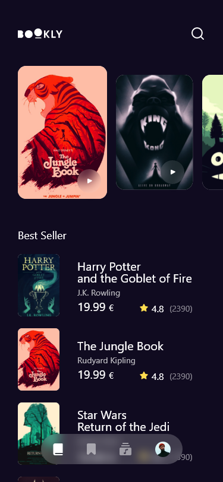

# 🎬 Bookly App

The Bookly App is a mobile application designed to search and filter free books available via the Google Books API. This app was developed as part of a training course by Tharwa Sami and is intended for educational purposes only.

## ✨ Features

- **Responsive and Beautiful Design**: Ensures a seamless user experience across different devices.
- **MVVM Architecture**: Utilizes the Model-View-ViewModel pattern for organized code.
- **Clean Architecture**: Employs a well-structured approach with separation of concerns.
- **Nested Scrolling**: Implements smooth and efficient nested scrolling for displaying book content.

## 📸 Screenshots

<div style="display: flex; gap: 10px; justify-content: space-between;">
  
  
</div>

## 🛠️ Technologies Used

- **Flutter**: The primary framework used for building the app.
- **Dart**: The programming language employed for development.
- **Clean Architecture**: Organizes code into layers (Presentation, Domain, Data) to enhance maintainability and scalability.
- **State Management**: Utilizes reactive programming techniques for efficient state management.
- **Dependency Injection**: Facilitates testing and decouples code.

## 📚 Learning Outcomes

Through this project, I have gained practical experience in:

- Implementing Clean Architecture within a real-world Flutter application.
- Structuring code into distinct layers to separate concerns.
- Using dependency injection to manage dependencies effectively.
- Applying state management techniques for building responsive and efficient UIs.
- Debugging and optimizing Flutter applications to improve performance.

## 📦 Packages Used

- **[cached_network_image](https://pub.dev/packages/cached_network_image)**: ^3.2.3
- **[dartz](https://pub.dev/packages/dartz)**: ^0.10.1
- **[dio](https://pub.dev/packages/dio)**: ^5.6.0
- **[equatable](https://pub.dev/packages/equatable)**: ^2.0.5
- **[flutter_bloc](https://pub.dev/packages/flutter_bloc)**: ^8.1.1
- **[font_awesome_flutter](https://pub.dev/packages/font_awesome_flutter)**: ^10.4.0
- **[get_it](https://pub.dev/packages/get_it)**: ^7.2.0
- **[go_router](https://pub.dev/packages/go_router)**: ^14.2.7
- **[google_fonts](https://pub.dev/packages/google_fonts)**: ^6.2.1
- **[hive](https://pub.dev/packages/hive)**: ^2.2.3
- **[hive_flutter](https://pub.dev/packages/hive_flutter)**: ^1.1.0
- **[url_launcher](https://pub.dev/packages/url_launcher)**: ^6.1.7

## 📚 Course Details

- **Course Name**: [Deep Dive into Clean Architecture in Flutter[Arabic]](https://www.udemy.com/share/108tfg3@RxttKTRbA9uqV-3deoOHGmA9PU5XWyqOTRyFWFJF93o2cxttRE-f5MdGE9aIpqeLXw==/)
- **Instructor**: [Tharwat Samy](https://www.udemy.com/user/tharwat-samy)
- **Certificate Issued To**: [Ayman Al-khatib](https://www.udemy.com/certificate/UC-63fbd22a-99d6-47fc-85ff-8d56040d2a57)

## 🚀 Getting Started

To get a local copy up and running, follow these steps:

### Prerequisites

- **Flutter SDK**: [Installation Guide](https://flutter.dev/docs/get-started/install)
- **Dart SDK**: Included with Flutter.
- **Code Editor**: Use VSCode, Android Studio, or any preferred code editor.

### Installation

1. Clone the repository:
   ```sh
   git clone https://github.com/Ayman-Al-Khatib/bookly.git
2. Navigate into the project directory:
   ```sh
   cd bookly
3. Install the dependencies:
   ```sh
   flutter pub get
4. Run the application:
   ```sh
   flutter run